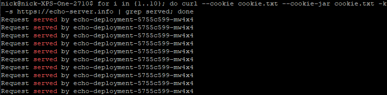

# Kubernetes Nginx Ingress Controller on Minikube 
## Minikube provides a very easy way to standup a local, single node kubernetes development cluster. In this example, we will utilize Minikube and deploy the nginx ingress controller to manage new ingress objects that will provide virtual host routing, ssl termination, and session affinity/stickiness. We will build this application from the ground up, and slowly add new functionality via different kubernetes objects to illustrate their purpose.  


## Prerequisites:  
Install minikube before proceeding.  

Offical Minikube install reference:  
https://minikube.sigs.k8s.io/docs/start/ 

## Build Procedure:
1. Start minikube if not already running:  
  ```shell
  minikube start  
  ```
  
2. Optional: Create alias for kubectl to reduce keystrokes. Example for debian based linux distribution:  
  ```shell  
  echo 'alias kubectl="minikube kubectl --"' >> ~/.bashrc   
  ```
  
3. Install the nginx ingress controller in minikube by enabling an addon:  
  ```shell  
  minikube addons enable ingress  
  ```

4. Verify the nginx ingress controller was installed and it's pod is running:  
  ```shell
  kubectl -n ingress-nginx get pods
  minikube service list
  ```

5. Create the namespace for the echo-server application:  
  ```shell
  kubectl apply -f echo-server-namespace.yaml
  kubectl get namespace
  ```
  
6. Create a deployment for this application, which will create 3 echo-server pods, a replicaset, and the deployment object:   
  ```shell
  kubectl apply -f echo-server-deployment.yaml
  kubectl get all -n echo-server
  ```

7. Create a service of type NodePort to expose this application externally from the minikube cluster:  
  ```shell
  kubectl apply -f echo-server-service-nodeport.yaml
  kubectl get service -n echo-server
  ```
  
8. Test the application, using the minikube ip address and the dynamically allocated NodePort tcp port. Notice how load is distributed accross all three echo-server application pods:  
  ```shell
  IP=$(minikube ip)
  PORT=$(kubectl get service -n echo-server | grep -v TYPE | awk '{print $5}' | cut -d : -f2 | cut -d '/' -f1)
  curl http://${IP}:${PORT}
  for i in {1..10}; do curl -s http://${IP}:${PORT} | grep served; done
  ```
      
  
  
9. Create an ingress that will handle http/clear text traffic:  
  ```shell
  kubectl apply -f echo-server-ingress-http.yaml
  kubectl get ingress -n echo-server
  ```
  
10. The hostname of this app is NOT resolvable via DNS, so you will need to create an entry in /etc/hosts:
  ```shell
  echo "$(minikube ip) echo-server.info" | sudo tee -a /etc/hosts
  ping echo-server.info
  ```
  
11. Test the application using only the hostname defined in the ingress previously created:
  ```shell
  curl http://echo-server.info
  ```

12. To enable https/ssl termination from our ingress, we will need to generate a certificate and private key first:
  ```shell
  openssl req -x509 -nodes -days 365 -newkey rsa:2048 -keyout echo-server.info.key -out echo-server.info.crt -subj "/CN=echo-server.info/O=echo-server.info"
  ```
  
13. Create a kubernetes Secret to house the cert and key generated in the previous step:
  ```shell
  kubectl create secret tls echo-server-secret-tls --key echo-server.info.key --cert echo-server.info.crt -n echo-server
  kubectl describe secret -n echo-server
  ```
  
14. Update the ingress object using the https version of the object definition, which will utilize the secret generated in the previous step:
  ```shell
  kubectl apply -f echo-server-ingress-https.yaml 
  kubectl get ingress -n echo-server
  ```
  
15. Attempt to access this ingress using http, and you will see receive a status code of 308 indicating a permanent redirect:
  ```shell
  curl http://echo-server.info
  ```

16. Now attempt to access this ingress using https with the '-k' switch to bypass warnings due to self-signed certificates:
  ```shell
  curl -kv https://echo-server.info
  ```
  
17. Now attempt to access this ingress using https with the '-k' switch to bypass warnings due to self-signed certificates. SSL is now being terminated at our ingress!:
  ```shell
  curl -kv https://echo-server.info
  ```
  
18. The last piece of functionality we would like to incorporate to our ingress is session affinity/stickiness. As of now, each request will be 'evenly' distributed to the backend pods, but we would like subsequent requests from the same client to be bound to a particular pod. We will update the ingress object using the sticky version of the object definition:
  ```shell
  kubectl apply -f echo-server-ingress-https-sticky.yaml
  kubectl get ingress -n echo-server
  ```
  
19. The final test: Access the application using https and ensure each request is served by the same backend pod. Note: you will need to explicity define your cookie values if testing via curl, as a curl request doesn't utilize cookies by default:
  ```shell
  for i in {1..10}; do curl --cookie cookie.txt --cookie-jar cookie.txt -k -s https://echo-server.info | grep served; done
  ```
  
 
