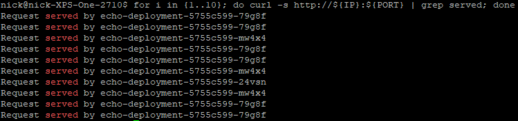

# Kubernetes Nginx Ingress Controller on Minikube 
## Minikube provides a very easy way to standup a local, single node kubernetes development cluster. In this example, we will utilize Minikube and deploy the nginx ingress controller to manage new ingress objects that will provide virtual host routing, ssl termination, and session affinity/stickiness. We will build this application from the ground up, and slowly add new functionality via different kubernetes objects to illustrate their purpose.  


## Prerequisites:  
Install minikube before proceeding.  

Offical Minikube install reference:  
https://minikube.sigs.k8s.io/docs/start/ 

## Build Procedure:
1. Start minikube if not already running:  
  ```shell
  minikube start  
  ```
  
2. Optional: Create alias for kubectl to reduce keystrokes. Example for debian based linux distribution:  
  ```shell  
  echo 'alias kubectl="minikube kubectl --"' >> ~/.bashrc   
  ```
  
3. Install the nginx ingress controller in minikube by enabling an addon:  
  ```shell  
  minikube addons enable ingress  
  ```

4. Verify the nginx ingress controller was installed and it's pod is running:  
  ```shell
  kubectl -n ingress-nginx get pods
  minikube service list
  ```

5. Create the namespace for the echo-server application:  
  ```shell
  kubectl apply -f echo-server-namespace.yaml
  kubectl get namespace
  ```
  
6. Create a deployment for this application, which will create 3 echo-server pods, a replicaset, and the deployment object:   
  ```shell
  kubectl apply -f echo-server-deployment.yaml
  kubectl get all -n echo-server
  ```

7. Create a service of type NodePort to expose this application externally from the minikube cluster:  
  ```shell
  kubectl apply -f echo-server-service-nodeport.yaml
  kubectl get service -n echo-server
  ```
  
8. Test the application, using the minikube ip address and the dynamically allocated NodePort tcp port. Notice how load is distributed accross all three echo-server application pods:  
  ```shell
  IP=$(minikube ip)
  PORT=$(kubectl get service -n echo-server | grep -v TYPE | awk '{print $5}' | cut -d : -f2 | cut -d '/' -f1)
  curl http://${IP}:${PORT}
  for i in {1..10}; do curl -s http://${IP}:${PORT} | grep served; done
  ```
      
  
  
9. Create an ingress that will handle http/clear text traffic:  
  ```shell
  kubectl apply -f echo-server-ingress-http.yaml
  kubectl get ingress -n echo-server
  ```
  
10. The hostname of this app is NOT resolvable via DNS, so you will need to create an entry in /etc/hosts:
  ```shell
  echo "$(minikube ip) echo-server.info" | sudo tee -a /etc/hosts
  ping echo-server.info
  ```
  
11. The hostname of this app is NOT resolvable via DNS, so you will need to create an entry in /etc/hosts:
  ```shell
  echo "$(minikube ip) echo-server.info" | sudo tee -a /etc/hosts
  ping echo-server.info
  ```


